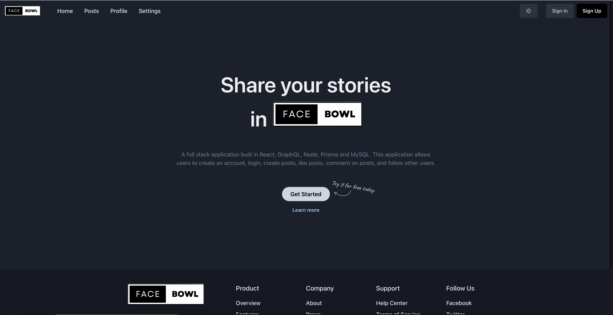
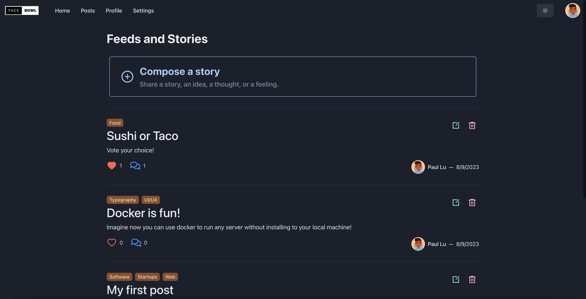
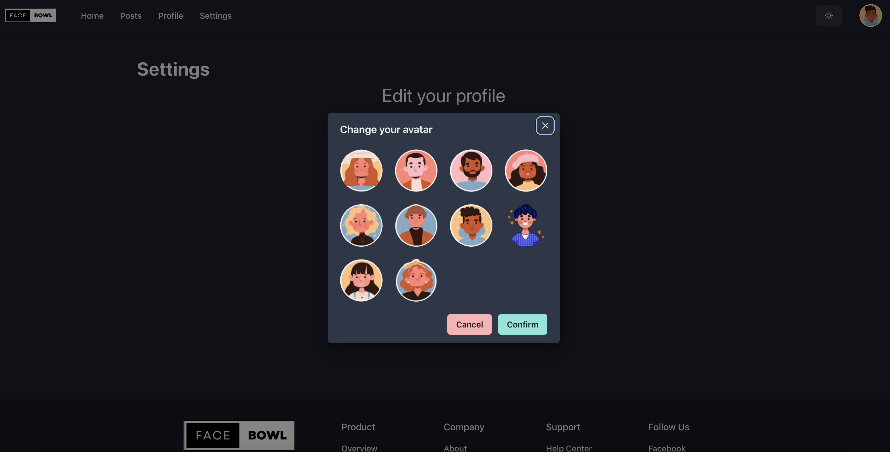

<!-- @format -->

# Facebowl GraphQL Blogging Website (ClientSide)

## [Facebowl Serverside](https://github.com/pawpaw2022/gql-blogging-website)

Welcome to Facebowl, a blogging website where users can create, view, update, and interact with posts and profiles. This React app is built using the latest technologies to provide a seamless and engaging user experience.

## Technologies Used

- **React 18:** A powerful JavaScript library for building user interfaces. React allows for the creation of reusable UI components, enhancing the development process and enabling efficient rendering.

- **Chakra UI:** A highly customizable component library for React that enables the creation of consistent and attractive user interfaces. Chakra UI provides a collection of accessible and responsive UI components out of the box.

- **TypeScript:** TypeScript is a superset of JavaScript that adds static typing. It enhances code quality and maintainability by catching errors early during development and providing better code documentation.

- **GraphQL Client:** GraphQL is a query language for APIs that allows you to request specific data from the server. The GraphQL client in this app facilitates communication with the GraphQL server, fetching and sending data efficiently.

## Features

- **User Authentication:** Users can sign up, sign in, and log out using JWT-based authentication. Certain actions require authentication, while others are accessible without logging in.
- **View Posts:** Users can view posts created by other users.
- **Create, Update, Delete Posts:** Authenticated users can create new posts, update their own posts, and delete their posts.
- **Like, Unlike Posts:** Authenticated users can like and unlike posts.
- **Commenting:** Users can leave comments on posts, edit their comments, and delete comments.
- **Profile Management:** Users can edit their profiles, change avatars, bios, and basic information.
- **View Others' Profiles:** Users can view profiles of other users to learn more about them.
- **UI Using Chakra UI:** The user interface is designed using Chakra UI, providing a modern and responsive design.
- **GraphQL Client:** Utilizes a GraphQL client to interact with the backend API.

## Showcase

